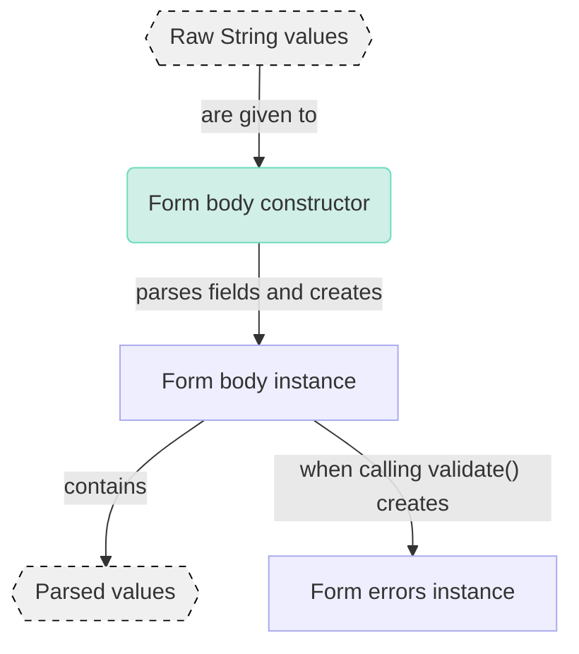

# ▲ Shape

A package for building forms that can be easily reused, validated, and parsed, primarily for Flutter apps.

### Table of Contents

- [▲ Shape](#-shape)
  - [Table of Contents](#table-of-contents)
  - [Summary](#summary)
  - [Usage](#usage)
  - [Principle](#principle)
  - [Features](#features)
    - [Access parsed values](#access-parsed-values)
    - [Automatic form error generation](#automatic-form-error-generation)
  - [Example](#example)

### Summary

This package comes in three parts:

- **The `shape` package** that contains the primary classes and annotations used for creating form bodies.
- [**The `shape_generator` package**](https://github.com/betterment/shape/tree/main/packages/shape_generator/README.md), which is the code generator that runs on classes annotated with `@GenerateFormBody()`.

### Usage

First, add the `shape` package to your project's dependencies using `dart pub add` or `flutter pub add`.

```bash
dart pub add shape
```

Then, add the `shape_generator` and `build_runner` packages to your project's dev dependencies using the same CLI.

```bash
dart pub add --dev shape_generator build_runner
```

> [!NOTE]
> If these commands don't work for you, consider adding the packages manually to your `pubspec.yaml` file by placing the `shape` package under `dependencies` and the `shape_generator` and `build_runner` packages under `dev_dependencies`.

To generate a form body, in this case called `ExampleFormBody`;

1. Create an abstract class `ExampleFormBody` annotated with `@GenerateFormBody()`.
2. Add the `_$ExampleFormBodyFields` mixin.
3. Create a single unnamed factory that returns an instance of `_$ExampleFormBody` containing all form fields that should be present in the form body. All parameters must be an instance of a class that extends `FormField`, a class provided by this package.

A full example might look like this:

```dart
import 'package:shape/shape.dart';
import 'package:shape_addons/shape_addons.dart';

part 'example_form_body.g.dart';

@GenerateFormBody()
abstract class ExampleFormBody with _$ExampleFormBodyFields {
  factory ExampleFormBody({
    required String? foo,
    required String? bar,
  }) {
    return _$ExampleFormBody(
      name: GenericFormField(
        value: foo,
        isRequired: true,
      ),
      otherName: RangedDoubleFormField(
        value: bar,
      ),
    );
  }
}

void main() {
  final formBody = ExampleFormBody();
}
```

### Principle

Shape works by separating form fields, bodies, validation logic and parsing logic into separate classes.

Form bodies are a collection of form fields. The flow of data going into and coming out of a form body looks as follows:



### Features

#### Access parsed values

Form bodies take in raw values and produce parsed values. Whenever a form body is constructed or copied (using `copyWith`), the values are automatically parsed and accessible as properties with the same name as the original field.

```dart
var formBody = TaxFormBody(vatPercentage: null);
print(formBody.vatPercentage); // null

formBody = formBody.copyWith(vatPercentage: '0.0');
print(formBody.vatPercentage); // Percent('0%')
```

#### Automatic form error generation

When generating a form body, an adjacent [`FormErrors`] class is also created and accessible.

```dart
var formBody = TaxFormBody(vatPercentage: null);
print(formBody.validate()) // TaxFormErrors(vatPercentage: PercentValidationError.empty)

formBody = formBody.copyWith(vatPercentage: 'abc');
print(formBody.validate()) // TaxFormErrors(vatPercentage: PercentValidationError.invalid)

formBody = formBody.copyWith(vatPercentage: '2.0');
print(formBody.validate()) // TaxFormErrors(vatPercentage: null)
```

### Example

To run the example, run `build_runner` in [the `example` folder](https://github.com/betterment/shape/tree/main/packages/shape/example).

```shell
cd example
flutter pub run build_runner build --delete-conflicting-outputs
```

A new form body will be generated based on the contents of [`example/lib/example_form_body.dart`](https://github.com/betterment/shape/tree/main/packages/shape/example/lib/example_form_body.dart). After the code generator has completed, examine the contents of the file [`example/lib/example_form_body.g.dart`](https://github.com/betterment/shape/tree/main/packages/shape/example/lib/example_form_body.g.dart).
